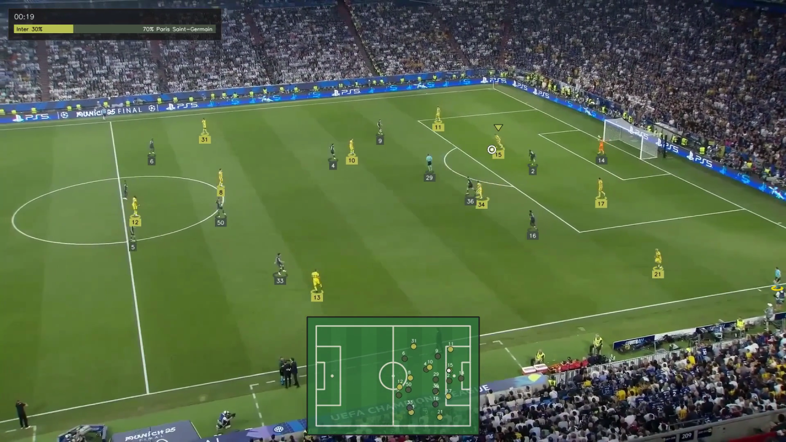

# Match Tag — football event tagging, with a computer-vision first pass

Tag the events of a football match by hand, or point a set of trained vision
models at the video and have them tagged for you. Both produce the same
objects, in the same coordinate system, in the same table — so the analyst's
job is to correct the machine, not to choose between them.



---

## What it does

**The tagger.** Load a match video from your device, pick an event type, and
click the pitch. Passes, crosses, shots, dribbles and clearances take two
clicks — where the ball started and where it ended; tackles, interceptions and
blocks take one. Events land on a 120 × 80 pitch grid, on a match timeline
beside the video, and in a table you can filter, sort and correct. Nothing is
uploaded.

**The analysis.** Press *Analyse with AI* and the video is read by three
models: one finds the players, goalkeepers, referees and ball; one finds the
pitch's own markings and turns pixels into metres; a third rescues the ball on
the frames the first one loses it. From the tracks it derives who had the ball,
and from the changes of possession it derives the events — a pass is a change
inside a team, a tackle is a change between teams, a shot is possession ending
at the goal. The events it produces are ordinary events: they appear on the
same pitch, in the same table, and can be edited or deleted like any other.

**The statistics.** Possession, passes and accuracy, shots and shots on target,
crosses, dribbles, tackles, interceptions, clearances, distance covered, top
speed, positional heatmaps and a pass network — computed from whichever events
exist, hand-tagged or detected.

---

## Running it

### 1. Install

Two dependency sets: the web app is small, the vision engine is not.

```bash
python3.10 -m venv .venv && source .venv/bin/activate

pip install -r match_tag/requirements.txt      # the tagger alone
pip install -r requirements-cv.txt             # plus the vision engine
```

Python 3.10–3.12. The vision engine uses an NVIDIA GPU if there is one, Apple's
GPU on an M-series Mac, and the CPU otherwise; nothing needs configuring.

### 2. Get the models

The three models are trained from open datasets, which the scripts fetch for
you:

```bash
python training/scripts/download_datasets.py    # ~430 MB, CC BY 4.0
python training/scripts/prepare_data.py
python training/scripts/train.py players        # ~3 h on an M2
python training/scripts/train.py pitch          # ~5 h
python training/scripts/train.py ball           # optional, improves the ball
```

Weights land in `models/`. Training can be interrupted and picked up again:

```bash
python training/scripts/train.py players --resume
```

Without `players` and `pitch` the tagger still runs; the *Analyse with AI*
panel simply says what is missing and how to get it.

### 3. Start it

```bash
python match_tag/app.py
```

Then open <http://localhost:5055>. (Port 5055 rather than 5000: macOS binds
5000 to its AirPlay receiver.)

---

## From the command line

The same pipeline without a browser:

```bash
python analyse.py input_videos/match.mp4 --team1 Gladbach --team2 Wolfsburg
python analyse.py match.mp4 --limit 120 --no-video --json events.json
python analyse.py match.mp4 --csv events.csv --fps 25
```

It prints a match report, and writes an annotated video with a tactical radar
unless told not to.

---

## How the analysis works

```
video ──> split into shots ──> detect ──> track ──> re-link ──┐
                  │              │                            ├──> possession ──> events
                  │              └──> pitch keypoints ────────┘         │
                  │                        │                            └──> annotated video
                  └── resets everything    └──> homography (pixels -> metres)
                      that remembers
```

**Shots.** A televised match is hundreds of edits — replays, close-ups, the
bench, the crowd. Every stage after this one assumes the camera moves
continuously: the tracker matches a player to the nearest box, the calibration
carries a homography through frames it could not solve, the ball search looks
where the ball last was. All three assumptions break at a cut, and the third
failure is the expensive one — a replay of a goal is, to everything
downstream, a second goal.

So the video is split first. Each frame is reduced to a coarse greyscale grid
and compared with the one before it; a jump far above the recent norm is an
edit, and everything that remembers is reset there. The threshold is relative
rather than fixed because a tripod and a hand-held broadcast camera sit at
completely different baselines. A colour histogram was tried first and measured
worse — a cut from one wide shot of the pitch to another barely changes the
colours, being the same grass and the same kits, while rearranging where
everything sits. Layout is what an edit destroys.

Shots are then judged: one where the pitch is never located is a replay or a
face, not play, and is kept out of the numbers.

On a deliberately edited clip — six passages reordered, so every join is a cut
with a known frame — all five cuts are found with no false alarms, and the
effect on the analysis is not subtle:

| | cuts ignored | cuts detected |
|---|---|---|
| players "tracked" | **101** | **33** |
| tracked fragments | 145 | 41 |

A pitch holds twenty-two players and three officials. The first column is what
a broadcast does to a system that thinks the camera never moves.

**Detection.** A YOLO model over four classes: ball, goalkeeper, player,
referee. The ball is about twelve pixels wide in a broadcast frame and is the
object everything else depends on, so a second single-class model searches the
region around its last known position whenever the first comes up empty.

That specialist is trained on native-resolution 640-pixel windows rather than
on whole frames, and the difference is the whole story. Trained on frames at
`imgsz=640`, a 1920-wide broadcast image is shrunk by three and the model only
ever learns a **four pixel** ball — while inference asks it about a native
window holding a twelve pixel one. Whole-image mAP hid this completely; the
regime the detector actually spends its time in did not:

| what the model is shown | found the ball | **wrong box** | found nothing |
|---|---|---|---|
| full frame at 640 | 26% | 4% | 70% |
| full frame at 1280 | 62% | 22% | 15% |
| **native window — used on ~96% of frames** | **34%** | **60%** | 6% |

Retrained on windows, measured the same way, the hot path goes to **87% found
and 2% wrong**, and the tiled sweep to 82% / 4%. On real footage the effect is
visible without any labels at all: the share of consecutive ball sightings more
than fifteen metres apart — a distance no ball covers between frames, so every
one of them is a false positive — falls from **13% to 2%**, and the median
frame-to-frame movement from 2.2 m to 0.7 m. The path the ball traces is now a
path a ball could take.

A wrong box is worse than no box. A missing frame is bridged by the ball
interpolation; a confident detection on somebody's sock is not, and possession,
passes and every event derived from them follow it there.

Two things caused it, and `training/scripts/prepare_ball_crops.py` fixes both.
The model is now trained on windows of exactly the size and scale it will be
asked about, with the ball deliberately off-centre because at inference the
window is aimed at where the ball *was*. And the training set now contains
windows with no ball in it at all — of the 989 source frames, every single one
held a ball, so the model had never once been shown a pitch and told there was
nothing there. A detector that has never seen a negative answers every question
with a ball.

The whole-frame sweep, used to reacquire the ball after a long occlusion, is a
grid of the same native windows for the same reason (`tile_windows`), so every
path feeds the model the one thing it was trained on.

**Tracking.** ByteTrack gives each player an identity frame by frame. Positions
are taken at the feet — the bottom-centre of the box, not its centre — because
only the feet are on the plane the homography maps.

**Re-linking.** ByteTrack decides in image space, so a camera pan moves every
box at once and the overlap it looks for disappears; it retires the identity
and issues a new one to the same person a moment later. Occlusion does the
rest. Left alone this produces about three identities per player, which ruins
every statistic that accumulates and manufactures turnovers wherever an
identity ends.

We are not a live feed, so the association is redone offline once the whole
clip has been seen. Fragments are matched in *pitch metres*, which cancels the
camera motion that broke the tracking in the first place, under constraints
that are physical rather than visual: two fragments visible in the same frame
are certainly different people; a displacement no human could cover in the time
available is refused; the two teams and the officials never mix. Each round is
solved as one global assignment rather than greedily, and a winner that is
barely better than the runner-up is dropped rather than guessed — on a pitch
the nearest other player is only a few metres away, so a close race is not
evidence.

Measured on held-out splits (`training/scripts/evaluate_stitch.py`, which cuts
long tracks in half and checks whether they are reunited): **98% of gaps up to
2.5 seconds rejoined, with no wrong joins**. On a real clip this takes 3.2
identities per player down to 2.0 and lifts the mean identity lifetime from 9.7
to 15.5 seconds.

Past about three seconds it stops working, and the evaluation says so: precision
falls below 0.7 because a player can be anywhere within thirty metres by then,
and thirty metres of a pitch contains most of both teams. No amount of tuning
fixes that — teammates are dressed identically on purpose. Closing longer gaps
needs something that identifies a *person* rather than a place, which in
football means the number on the shirt.

**Calibration.** A pose model locates up to 32 pitch landmarks: corners, box
corners, penalty spots, the extremes of the centre circle. Four of them
determine a homography from the image to the pitch, and because we know where
each landmark sits on a real pitch, that homography is in metres. Candidates
are validated by reprojecting the pitch back into the image and rejecting
anything degenerate, and recent good solutions are reused across frames where
too few landmarks are visible. The pitch is defined at FIFA standard dimensions
so that the metres it produces are real metres.

**Teams.** Nothing about the two kits is known in advance, so they are learned
from the footage: jersey colour is sampled from frames spread across the whole
clip and clustered in two. Grass is removed by similarity to *this frame's
measured grass colour* rather than by a green hue rule — a hue rule deletes a
green kit and leaves nothing to classify. Each track is then labelled by
majority vote across all its appearances, which is what makes the assignment
stable when a single frame is blurred or in shadow. Goalkeepers wear neither
kit and are assigned by which end they occupy.

**Possession.** Per frame, the nearest eligible player to the ball, measured in
metres rather than pixels — two players twenty pixels apart are beside each
other at the near touchline and fifteen metres apart at the far one. Possession
must be *held* for several frames before it switches, and it survives a short
gap with nobody near the ball, because that gap is what a pass in flight looks
like.

**Clips.** The annotated video proves the analysis works and nobody watches
it. A coach handed ninety minutes of footage with rings drawn on it has been
handed ninety minutes of footage; what they want is the eleven shots, in two
minutes. The analysis already knows when everything happened to the frame, so
cutting a short clip per event costs one more pass over the video.

Two things decide whether the clips are watchable. The window reaches further
back than forward, because an event is recorded where it *ends* — a pass at the
moment the ball leaves the foot — and starting there shows the consequence
while hiding the cause. And events close together become one clip: three files
covering the same four seconds is worse than one, and makes a passage of play
look like three unrelated fragments. That merging is capped, because the first
real run of it chained every event in a busy passage into a single "clip" that
was the whole video again.

Files are named for what is in them (`001_00m21s_Shot_5.mp4`), so a folder
listing is readable without opening anything.

**Events.** Read off the transitions between possession spells, with the ball's
own trajectory deciding the ambiguous cases. A ball merely pointed at goal is
not a shot — a forward pass in the final third is pointed at goal too — so an
attempt has to arrive: the tracked ball must reach the goal area, or be
gathered by the opposing keeper. Every event carries a confidence, because none
of this is certain.

---

## Layout

```
football_ai/          the vision engine
  pitch.py            pitch geometry and the three coordinate systems
  video.py            streaming video I/O
  segments.py         splitting a broadcast into shots
  clips.py            cutting each event out as its own short video
  detect.py           player / ball detection, native-window search
  track.py            identity across frames, ball interpolation
  stitch.py           offline re-linking of split identities
  calibrate.py        landmarks -> homography
  teams.py            kit clustering and per-track voting
  possession.py       who has the ball
  events.py           possession -> football
  stats.py            match and player statistics
  render.py           annotated video and tactical radar
  pipeline.py         the orchestrator

match_tag/            the web application
  app.py              Flask app factory
  models.py           database schema, with in-place migration
  api.py              saved matches and events
  analysis.py         upload, run, import
  jobs.py             the background worker
  templates/, static/ the interface

training/scripts/     dataset download, training and evaluation
tests/                unit tests for the football reasoning
analyse.py            command-line analysis
```

---

## Datasets

All three are CC BY 4.0 and are downloaded by
`training/scripts/download_datasets.py`:

| Model | Dataset | Images | Task |
|---|---|---|---|
| `players` | [football-player-detection](https://huggingface.co/datasets/martinjolif/football-player-detection) | 372 | ball / goalkeeper / player / referee |
| `pitch` | [football-pitch-detection](https://huggingface.co/datasets/martinjolif/football-pitch-detection) | 317 | 32 pitch landmarks |
| `ball` | [football-ball-detection](https://huggingface.co/datasets/martinjolif/football-ball-detection) | 1,237 | ball only, tight crops |

---

## Tests

```bash
python -m pytest tests/ -q                 # the engine
node --test "tests/js/*.test.mjs"          # the statistics the browser computes
```

The tests cover the reasoning, not the models: that a turnover at close
quarters is a tackle and not an interception, that a pass aimed at goal is not
recorded as a shot, that a pitch homography built from nearly-collinear points
is rejected, that a green kit is not deleted along with the grass, that two
fragments seen in the same frame are never merged into one player, and that a
tracking identity swap does not add phantom kilometres to a player's distance.
None of them need a model or a video, so they run in seconds and catch the
class of bug that is otherwise only visible three minutes into an analysis.

`tests/test_integration.py` runs a fabricated passage of play — two passes, a
turnover and a shot — through possession, event derivation and statistics, and
checks the numbers that come out.

Two things cannot be tested this way, because there is no labelled data for
them, so they are measured on real footage instead:

```bash
python training/scripts/diagnose_tracking.py input_videos/match.mp4 --seconds 30
python training/scripts/evaluate_stitch.py  input_videos/match.mp4 --seconds 30
python training/scripts/evaluate_ball.py
python training/scripts/evaluate_events.py --truth 3 --predicted run.json
```

The first counts how many identities the tracker invents. The second scores the
re-linking against ground truth it builds by construction — it cuts long tracks
in half, hands the halves back as strangers, and checks whether they are
reunited — which gives a real precision and recall per gap length rather than
the "fewer identities is better" figure that a linker merging the whole pitch
into one player would win. The third measures the ball detector in each regime
the pipeline actually calls it in, separating "found nothing" from "confidently
found the wrong thing" — a distinction a single mAP figure erases, and the one
that matters most here.

The fourth answers the only question a customer actually asks, and the one no
detection metric can reach: are the passes passes? A detector can be flawless
while the football is wrong — the ball in exactly the right place, and
possession still given to the nearest player rather than the one who touched
it. There is no labelled dataset for this and there needs to be none, because
the tagger in this repository is the instrument for making one: tag a passage
of play by hand, run the analysis over the same passage, and compare. It
reports recall and precision per event kind, how often the outcome agreed, and
— separately — how far off the timings were, since most of that is the
tagger's own reaction time rather than anything the analysis did.

It also refuses to score an analysis against its own imported events, which a
saved match may well contain alongside the hand-tagged ones. That comparison
would report a flawless system.

---

## Notes on the machine

Training was tuned on an Apple M2 with 16 GB of unified memory. Two things
learned the hard way and encoded in the recipes:

- 960-pixel training at batch 8 needs about 10 GB and drives that machine into
  swap, where an epoch takes hours instead of two minutes. The recipes train at
  640 and recover small-object accuracy with the specialist ball model instead.
- Pose training is pinned to the CPU. Ultralytics has a long-standing bug on
  Apple's MPS backend ([ultralytics#4031](https://github.com/ultralytics/ultralytics/issues/4031))
  where the backward pass of a keypoint model raises a stride error. A CPU
  epoch costs about 170 s against roughly 95 s on MPS — a model that trains
  beats one that crashes.

---

## Deploying the demo

The `Dockerfile` at the root builds the tagger **without** the vision engine.
It installs only `match_tag/requirements.txt`; `requirements-cv.txt` — torch,
ultralytics, opencv, well over a gigabyte — is left out. The engine is imported
lazily by `match_tag/analysis.py`, so the app starts without it and reports the
engine as unavailable rather than failing.

```bash
docker build -t match-tag-demo .
docker run -p 5055:5055 match-tag-demo
```

The image sets `PUBLIC_DEMO=1`, which turns on a guard in `create_app()`:

| | |
|---|---|
| every non-`GET` under `/api/analysis` | `403` |
| `DELETE` under `/api/matches` | `403` |
| upload ceiling | 2 MB instead of 4 GB |

The analysis block runs in `before_request`, ahead of the request body. That
placement is the point: `start_analysis()` saves the uploaded file *before* it
checks whether the engine is available, so refusing later would still let a
stranger with the public URL fill the disk with videos nothing will read.

Without `PUBLIC_DEMO` set, behaviour is exactly as it is locally.

Two deployment details:

- **One worker.** `gunicorn -w 1`. The `JobRunner` holding analysis job state
  lives in the process, so a second worker would answer status polls about jobs
  it has never heard of. Concurrency comes from `--threads 4`.
- **Mount a volume at `/app/match_tag/instance`** if saved matches should
  survive a redeploy. The SQLite database lives there, and without a volume the
  container's filesystem takes it with it. `DATABASE_URL` pointing at Postgres
  is the other option.

---

## Licence

MIT. The datasets are CC BY 4.0 and are attributed above.

## Acknowledgements

This project started from [abdullahtarek/football_analysis](https://github.com/abdullahtarek/football_analysis). The vision engine (`football_ai/`), the Match Tag web app, the evaluation framework and the test suite were built from scratch on top of that starting point.
